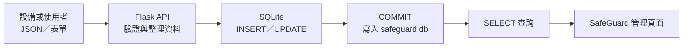

# SafeGuard SQLite 資料庫設計與實作報告

報告日期：2026-07-26

## 一、實作目標

SafeGuard 系統需要保存帳戶、UWB 人員定位、監控設備、設定區域、四個 UWB 基站，以及攝影機／LINE／UWB 的通訊紀錄。本次使用 Python 內建的 SQLite，資料全部保存在專案目錄的 `safeguard.db`，不需要另外安裝資料庫伺服器。

## 二、系統資料流程



實際處理順序：

1. UWB、攝影機、LINE 或管理頁面將資料送到 Flask。
2. Flask 檢查必要欄位並整理資料格式。
3. Python `sqlite3` 執行參數化 SQL，避免將輸入直接拼接到 SQL。
4. `commit()` 將異動保存到 `safeguard.db`。
5. 頁面透過 `SELECT` 查詢資料並顯示最新結果。

## 三、資料庫結構

| 資料表 | 用途 | 主鍵 | 本次驗證筆數 |
|---|---|---|---:|
| `users` | 系統帳戶與角色 | `id` | 2 |
| `people` | UWB 標籤、人員、座標與 PPE 狀態 | `id` | 1 |
| `monitoring_devices` | 攝影機、位置、串流網址及狀態 | `id` | 1 |
| `areas` | UWB 電子圍籬區域 | `id` | 2 |
| `base_stations` | 每個區域的四個 UWB 基站 | `id` | 4 |
| `communication_events` | UWB、Camera、LINE 與報告測試事件 | `id` | 2 |

`base_stations.area_id` 以外鍵連接 `areas.id`，代表每個基站必須屬於一個既有區域。Flask 開啟連線時會執行：

```sql
PRAGMA foreign_keys = ON;
```

## 四、SQLite 連線方式

程式在 `app.py` 設定資料庫檔案：

```python
DATABASE = os.path.join(app.root_path, "safeguard.db")
```

每個 Flask request 需要資料庫時才建立連線，request 結束後自動關閉：

```python
def get_db():
    if "db" not in g:
        g.db = sqlite3.connect(app.config["DATABASE"])
        g.db.row_factory = sqlite3.Row
        g.db.execute("PRAGMA foreign_keys = ON")
    return g.db
```

## 五、CRUD 操作範例

### 新增（Create）

```sql
INSERT INTO communication_events
  (source, device_id, event_type, payload, received_at)
VALUES (?, ?, ?, ?, ?);
```

問號是參數位置，實際資料由 `sqlite3.execute(sql, values)` 傳入。

### 查詢（Read）

```sql
SELECT id, source, device_id, event_type, payload, received_at
FROM communication_events
ORDER BY id DESC
LIMIT 5;
```

### 更新（Update）

```sql
UPDATE monitoring_devices
SET location = ?, stream_url = ?
WHERE id = ?;
```

### 刪除（Delete）

```sql
DELETE FROM monitoring_devices
WHERE id = ?;
```

## 六、網頁展示方式

1. 啟動系統：`python app.py`
2. 瀏覽 `http://127.0.0.1:5000`
3. 使用 `admin / admin123` 登入。
4. 在儀表板右上方點擊「SQLite 資料庫」。
5. 畫面會顯示 SQLite 版本、檔案名稱、檔案大小、六個資料表、欄位型別、筆數及最新五筆資料。
6. 點擊「建立一筆報告測試資料」，即可展示 `INSERT → COMMIT → SELECT`。
7. 下方「SQL 執行紀錄」會顯示本次操作使用的 SQL 與結果。

資料庫展示頁只允許管理員進入；`users.password` 不會傳到瀏覽器，頁面也不接受任意 SQL，以免密碼雜湊或資料庫遭到修改。

## 七、終端機展示方式

只查看資料：

```powershell
python sqlite_report_demo.py
```

新增一筆測試資料並立即查回：

```powershell
python sqlite_report_demo.py --insert
```

終端機會依序顯示：

```text
[步驟 1/4] 連接 SQLite 資料庫
[步驟 2/4] 查詢資料表筆數
[步驟 3/4] 執行 INSERT 並 COMMIT
[步驟 4/4] 用 SELECT 查回剛才新增的資料
```

## 八、本次測試資料

已建立一筆可辨識的報告測試紀錄：

| 欄位 | 值 |
|---|---|
| `id` | 2 |
| `source` | `report_demo` |
| `device_id` | `REPORT-SQLITE-001` |
| `event_type` | `sqlite_insert_demo` |
| `received_at` | `2026-07-26T20:53:49+08:00` |

## 九、驗證結果

| 測試項目 | 結果 |
|---|---|
| Python 語法編譯 | 通過 |
| 管理員登入 | HTTP 302，成功導向儀表板 |
| SQLite 展示頁 | HTTP 200 |
| 資料庫總覽 API | HTTP 200 |
| 測試資料 INSERT API | HTTP 201 |
| 六個資料表讀取 | 通過 |
| 寫入後立即 SELECT | 通過 |
| 使用者密碼未出現在展示 API | 通過 |
| 實際瀏覽器桌面畫面 | 通過 |

## 十、SQLite 的選用理由與限制

本專題目前採用 SQLite 的理由：

- 不需要另外安裝伺服器。
- 整個資料庫只有一個檔案，方便備份與報告展示。
- Python 內建 `sqlite3`，部署步驟少。
- 適合單機展示、小型專題與目前資料量。

限制是 SQLite 同一時間只允許一個寫入交易。若未來多台伺服器、大量攝影機或大量 UWB 裝置同時高頻寫入，可再評估遷移至 PostgreSQL；目前階段使用 SQLite 最容易操作與報告。

## 十一、結論

SafeGuard 已完成 SQLite 資料庫整合，六個主要資料表可保存系統設定與裝置事件。管理員可以直接從網頁觀察資料表結構、筆數、最新資料和 SQL 操作；也可在終端機重現完整寫入流程，適合用於系統展示及專題報告。
